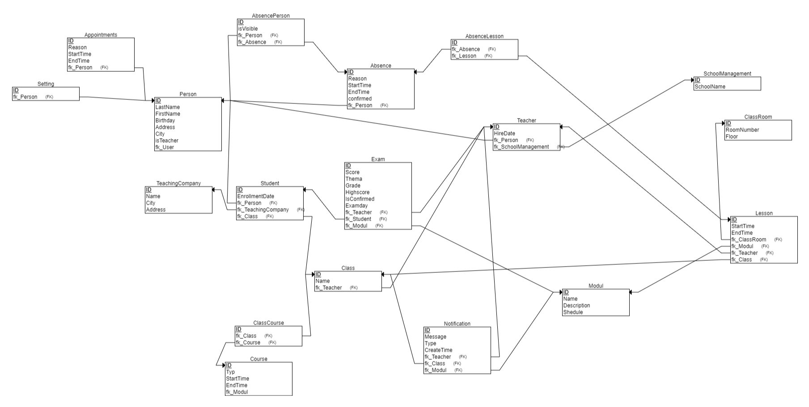
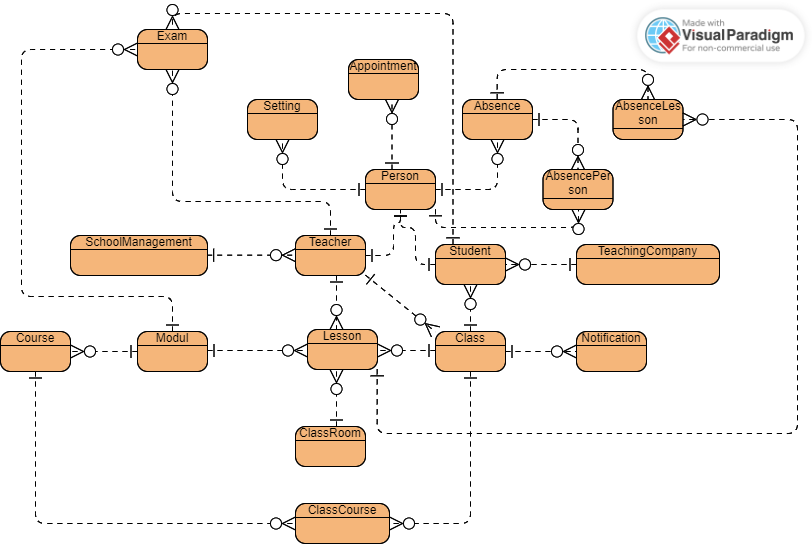

# NOT FINISHED YET PROBABLY WILL NEVER BE FINISHED
Gudrun is here to make life easier!

Welcome to GudrunDieSiebte, a website developed by @TheRealSpeedie. Gudrun is designed to provide schools and universities with an efficient and user-friendly management system. Feel free to explore the sections below to learn more about Gudrun and its features.

# Table of Contents
- [GudrunDieSiebte](#gudrundiesiebte)
- [Table of Contents](#table-of-contents)
- [Use of Gudrun](#use-of-gudrun)
  - [Use for Students](#use-for-students)
  - [Use for Teachers](#use-for-teachers)
  - [Use for School Management and Admins](#use-for-school-management-and-admins)
- [Installation](#installation)
- [Security](#security)
- [Database Structure](#database-structure)

# Use of Gudrun

This is how Gudrun looks like
!Important: Names and everything else is random generated and some words are in german!

## Use for Students

Students have a dedicated section that can be accessed once the admin has created the corresponding login and assigned the "student" role. The student interface is intuitive, providing access to all necessary information.

Here, students can view their grades. The grading system is structured as follows:
* 1 = -6
* 2 = -4
* 3 = -2
* 4 = 0
* 5 = +1
* 6 = +2

This system assumes that students maintain an average minimum of 0 to reflect performance. These settings can be customized or disabled in the code.

Insufficient grades are highlighted in red to provide a clear overview for teachers, students, and parents. Additionally, Gudrun includes a timetable feature where lessons, appointments, absences, and exams are displayed. This timetable can be downloaded and integrated into Outlook.

Finally, students can always access their current report cards, which are updated in real-time and can be downloaded.

## Use for Teachers

The teacher interface is focused on simplifying class management, specifically for classes they are involved with.

Gudrun offers an easy-to-use and clear absence management feature. There are three views available:
1. **Displayed Absences**: Shows the absences you want to see.
2. **Undisplayed Absences**: Shows the absences you choose not to display.
3. **All Absences**: Displays all absences, with the option to make undisplayed absences visible again.

These view settings are personalized and do not affect other teachers.

Significant effort went into developing the grade management system, ensuring that teachers can easily and quickly enter all grades or points.

## Use for School Management and Admins

The admin/school management section was designed to provide a comprehensive overview of all management tasks, including teacher absences.

A significant focus was placed on streamlining the process of adding new users. The system is designed to make it quick and easy for admins to create student and teacher accounts, saving valuable time.

# Security

Security is a top priority on our website. We have implemented all necessary measures to ensure that all data is protected. However, we do not accept any liability.

# Database Structure

Below is the structure of the database, including the columns:

Here is a detailed view of the relationships:

