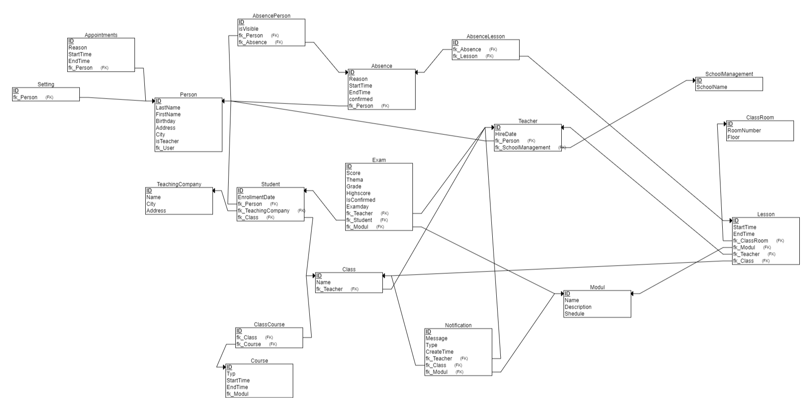
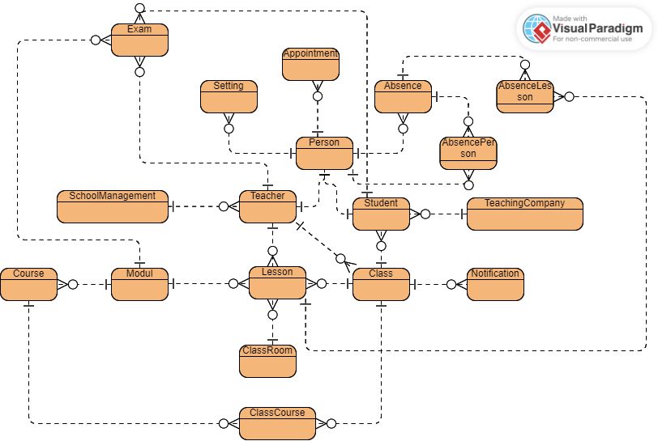

# 🎓 GudrunDieSiebte 📚  
**Effortless School & University Management**  

🚧 **Note:** This project is **not finished** and may never be completed.  

Gudrun is designed to **simplify school and university management** by providing an efficient and user-friendly platform for **students, teachers, and administrators**.  

---

## 📖 Table of Contents  

- [🎓 GudrunDieSiebte 📚](#-gudrundiesiebte-)
- [🔍 Use of Gudrun](#-use-of-gudrun-)
  - [👨‍🎓 Use for Students](#-use-for-students-)
  - [👩‍🏫 Use for Teachers](#-use-for-teachers-)
  - [🏫 Use for School Management and Admins](#-use-for-school-management-and-admins-)
- [⚙️ Installation](#️-installation-)
- [🔐 Security](#-security-)
- [🗃️ Database Structure](#-database-structure-)

---

## 🔍 Use of Gudrun  

Gudrun is designed to be a **complete school management system**.  
📌 **Important:** Names and some text elements are **randomly generated** and may appear in **German**.  

### 👨‍🎓 Use for Students  

Students have access to a **dedicated portal** where they can:  

✅ **View their grades** – The grading system works as follows:  
   - 1 = -6  
   - 2 = -4  
   - 3 = -2  
   - 4 = 0  
   - 5 = +1  
   - 6 = +2  

   *(Grades below the threshold are highlighted in red for clarity.)*  

✅ **Check their timetable** – Displays lessons, appointments, absences, and exams.  
✅ **Download report cards** – Always up-to-date and available for export.  

  

---

### 👩‍🏫 Use for Teachers  

Gudrun makes **class management simple** with:  

✔️ **Absence Management** – Three customized views:  
   1. **Displayed Absences** – Only selected absences.  
   2. **Undisplayed Absences** – Hidden absences.  
   3. **All Absences** – Full history with the option to restore hidden records.  

✔️ **Grade Management** – A user-friendly system for quick and easy grading.  

---

### 🏫 Use for School Management and Admins  

The **admin panel** provides full control over:  

✅ **User Management** – Quickly create student and teacher accounts.  
✅ **Teacher Absences** – A clear and detailed overview of missing personnel.  

---

## ⚙️ Installation  

Just build an Realese build in Visual Studio and the Software is ready to use.

---

## 🔐 Security  

Security is a **top priority**. All necessary measures have been taken to **protect user data**, but we **do not accept any liability**.  

---

## 🗃️ Database Structure  

The following **Entity-Relationship Diagrams (ERD)** illustrate the database design:  

  
  

---

## 📌 Future Improvements  

- [ ] **Complete development** of missing features.  
- [ ] **Multi-language support** (English, German, etc.).  
- [ ] **User roles & permissions** improvements.  
- [ ] **Enhanced security measures**.  

## 🤝 Contributing  

Feel free to contribute! Fork the repo, submit an issue, or create a pull request.  

## 📜 License  

This project is licensed under the **MIT License** – see the [LICENSE](LICENSE) file for details.  
